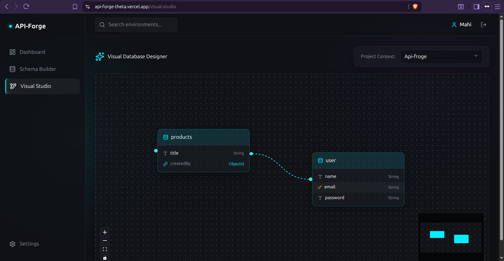
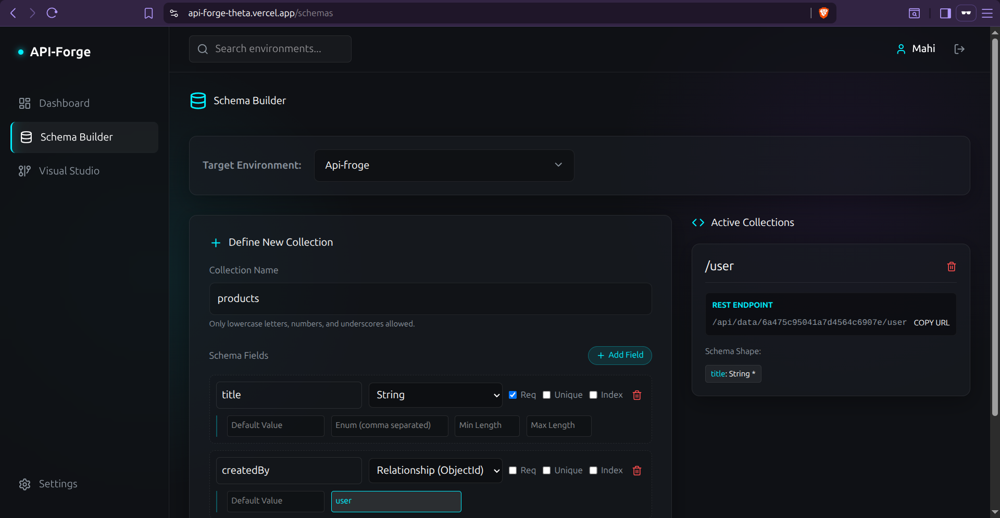
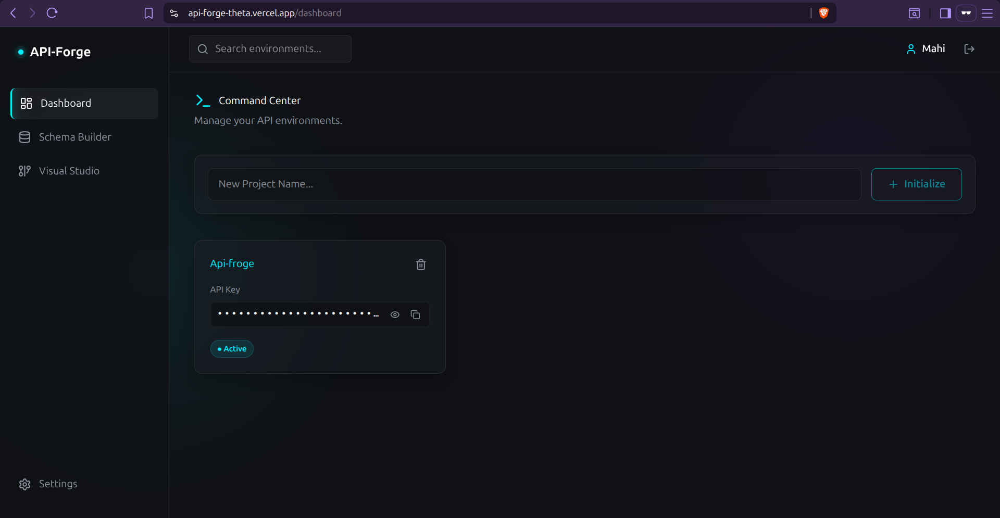
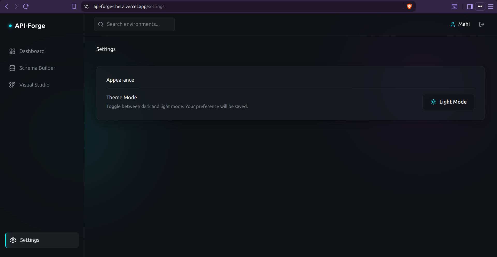
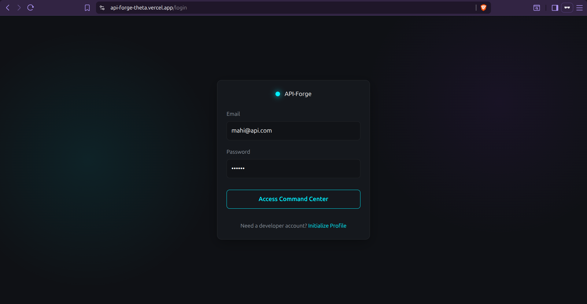
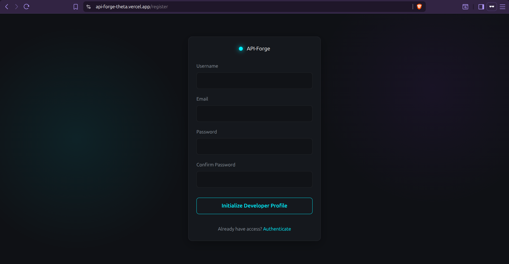

<div align="center">
  <h1>🚀 ApiForge: Enterprise-Grade Backend-as-a-Service</h1>
  <p>A headless CMS and multi-tenant dynamic API generator that empowers developers to visually design databases and instantly deploy production-ready REST APIs.</p>
</div>

---

## 📖 Overview

**ApiForge** is a fully functional Backend-as-a-Service (BaaS) platform built for scale. It solves the repetitive friction of writing boilerplate backend code. With ApiForge, developers can define schemas visually and the engine instantly provisions secured, isolated, and highly-performant REST endpoints powered by a wildcard routing architecture and the native MongoDB driver.

## ✨ Key Features

- 🏗️ **Visual Studio Database Designer**: An interactive, React Flow powered graph editor that allows users to visualize their entire database architecture and relational mapping.
- ⚡ **Dynamic API Generation**: Zero-configuration endpoints. Simply define a schema, and the backend dynamically generates `GET`, `POST`, `PUT`, and `DELETE` endpoints with built-in pagination, sorting, and advanced filtering.
- 🔐 **Multi-Tenant Data Isolation**: Implements a logical isolation strategy `({projectId}_{collectionName})` within a single scalable MongoDB instance, preventing cross-tenant data leakage without the overhead of provisioning separate databases.
- 🛡️ **Advanced Data Constraints**: Features a protective schema validation layer that intercepts bad requests. Enforces **Hard Foreign Keys**, Enums, min/max lengths, and geospatial data types at the application level.
- 🚀 **Native MongoDB Indexing**: Seamlessly offloads `Unique` constraints and custom indexing directly to the MongoDB engine for blisteringly fast query performance.

---

## 📸 Platform Previews

### The Visual Studio (Database ER Diagram)

*A professional birds-eye view of your data architecture. Draw connections to establish Foreign Key relationships.*

### Schema Builder

*Define strict schemas including Enums, GeoPoints, and default values. The engine instantly translates these into database validation rules.*

### Project Dashboard

*Monitor your generated APIs, manage collections, and track active API keys.*

### Project Settings

*Manage secure access controls and generate API keys for your client applications.*

### Authentication
<p align="center">
  
  
</p>

---

## 🛠️ Tech Stack

### Frontend (The Control Panel)
- **Framework**: React 19 + Vite
- **State Management**: Redux Toolkit (Persistent global state)
- **UI/UX**: TailwindCSS, Lucide Icons, Glassmorphism design principles
- **Diagramming**: React Flow (`@xyflow/react`)

### Backend (The BaaS Engine)
- **Runtime**: Node.js & Express.js
- **Database**: MongoDB (Native Driver & Mongoose hybrid)
- **Security**: JWT Authentication, bcryptjs, custom API Key middleware
- **Architecture**: Wildcard Dynamic Routing, Custom Validation Middleware

---

## 🧠 Architectural Decisions (The "Why")

1. **Native MongoDB over Mongoose for Dynamic Data**: 
   While Mongoose is used for platform metadata (Users, Projects, Schemas), the core BaaS engine utilizes the native MongoDB driver. This prevents the server from needing to pre-compile Mongoose models or restart every time a user generates a new collection.
2. **Hard Foreign Key Enforcement**:
   NoSQL databases don't natively enforce Foreign Keys. ApiForge implements a custom middleware layer (`dynamicValidator.js`) that queries the database to guarantee a referenced document exists before allowing relational `ObjectIds` to be saved.
3. **Redux for State Management**:
   Managing project context switches and complex nested schema states across multiple dashboard views required a highly predictable global state manager, ensuring the Visual Studio and Schema Builder always stay in sync.

---

## 🚀 Installation & Local Setup

### Prerequisites
- Node.js (v18+)
- MongoDB connection URI

### 1. Clone the repository
```bash
git clone https://github.com/yourusername/ApiForge.git
cd ApiForge
```

### 2. Setup the Backend
```bash
cd backend
npm install
```
Create a `.env` file in the `backend` directory:
```env
PORT=5000
MONGO_URI=your_mongodb_connection_string
JWT_SECRET=your_jwt_secret
```
Start the backend server:
```bash
npm run dev
```

### 3. Setup the Frontend
Open a new terminal window:
```bash
cd frontend
npm install
```
Start the frontend development server:
```bash
npm run dev
```
Navigate to `http://localhost:5173` in your browser.

---

<div align="center">
  <p>Engineered for the Modern Web.</p>
</div>